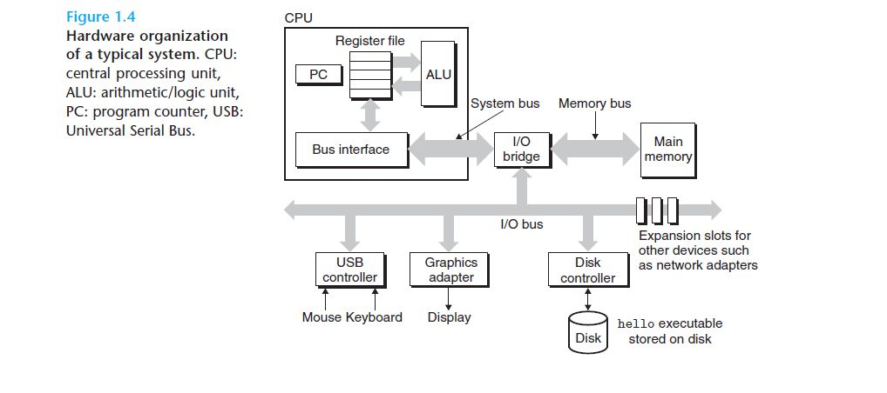

# Buses

Running throughout the system is a collection of electrical conduits called *buses*. Buses are typically designed to transfer fixed-size chunks of bytes known as ***words***. The number of bytes in a word (the *word size*) is a fundamental system parameter that varies across systems. Most machines today have word sizes of eithe 4 bytes (32 bits) or 8 bytes (64 bits).

> The *central processing unit* (CPU), or simply *processor*, is the engine that interprets (or *executes*) instructions stored in main memory. At its core is a word-size storage device (or *register*) called the *program counter* (PC). At any point in time, the PC points at (contains the address of) some machine-language instruction in main memory

# data bus

# address bus